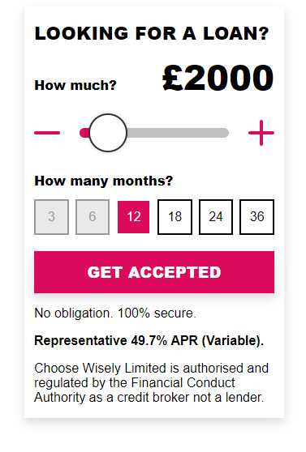

# Loan Slider Widget 

Get set up with a loan slider that you can use to introduce your site's visitors to Choose Wisely’s award winning personal loan comparison service.

- No API calls.
- No iframes.
- No REST responses.

The widget will allow your visitors to be redirected to Choose Wisely and begin their journey and matched against a comparison table showing their best available options.



## Get Started
Your code snippet comes in two parts. 
### Part 1, Container Tag
Paste this where you want the form to run on your site.

```html
<div id="ccWidget"></div>
```

### Part 2, The Script
Paste this just before the closing `</body>` tag.

```html
    <script type="text/javascript">
      window.ccWidget_conf = window.ccWidget_conf || {};
        ccWidget_conf = {
        key: 'your-affiliate-key-goes-here',
        ref: 'your-affiliate-reference-goes-here', // Optional
        elemId: 'ccWidget', // Container DOM element id to target
        theme: 'ChooseWisely' // Optional
      };
    </script>
    <script type="text/javascript" src="https://3pi.choosewisely.co.uk/ccwidget-loader.js"></script>
```
<br />

## Configuration Settings
The widget accepts the object `ccWidget_conf` as configuration with the following options.

### General
| Name            | Type     | Default       | Description                                                                                                                                                                                                    |
| --------------- | -------- | ------------- | -------------------------------------------------------------------------------------------------------------------------------------------------------------------------------------------------------------- |
| key             | String   | REQUIRED      | Your affiliate key, must be a valid key with no spaces.                                                                                                                                                        |
| ref             | String   | `''`          | Your affiliate reference, must be a valid reference with no spaces (max 48 characters).                                                                                                                        |
| gclid           | String   | `''`          | Your unique click id tracking parameter, must not contain spaces (max 100 characters).                                                                                                                         |
| elemId          | String   | `'ccApply'`   | Id of the element where your form will render, must be a valid id with no spaces.                                                                                                                              |
| theme           | Enum     | `'Default'`   | Apply one of the predefined themes to the form using a theme from the [list below](#themes).                                                                                                                   |
| staging         | Boolean  | `false`       | Use the staging environment with your staging `key` during setup and testing. |

### Loan Amount & Term Specific
| Name            | Type     | Default          | Description                                                                                                                                                                                                    |
| --------------- | -------- | ---------------- | -------------------------------------------------------------------------------------------------------------------------------------------------------------------------------------------------------------- |
| loanAmount      | Integer  | `2000`           | Loan amount for application. You may want to pass this to the form from your landing page.                                                                                                                     |
| loanTerm        | Integer  | `12`             | Loan term for application. You may want to pass this to the form from your landing page.                                                                                                                       |
| laMax           | Integer  | `10000`          | Maximum loan amount accepted by the form. Must be less than or equal to 25000.                                                                                                                                 |
| laMin           | Integer  | `100`            | Minimum loan amount accepted by the form. Must be more than or equal to 100.                                                                                                                                   |
| laStep          | Integer  | `100`            | The amount you want to increment the loan amount slider by.                                                                                                                                                    |
| submitText      | String   | `'Get Accepted'` | The text that will show inside your submit button.                                                                                                                                                             |
| sendingText     | String   | `'Sending...'`   | Message that the user will see after clicking the submit button on the form.  Also includes a loading bar.                                                                                                     |
| onSubmit        | Function | `NOOP`           | Callback that will run when the form is submitted. Single parameter contains the anonymised form data. Can be used to send events to analytics platforms like GA.                                              |

<br />

### Settings Example
```js
  window.ccWidget_conf = window.ccWidget_conf || {};
  ccWidget_conf = {
    key: 'your-api-key-goes-here',
    ref: 'your-ref-goes-here',
    elemId: 'ccWidget',
    theme: 'ChooseWisely',
    submitText: 'Get my quote',
    loanAmount: 2000,
    loanTerm: 12,
    laMax: 10000,
    laMin: 100,
    laStep: 100,
    onSubmit: function(sliderData){
      // sliderData contains submitted data values
      console.log(sliderData);
      
      // Send an event to google analytics for example.
      // window.ga('send', {
      //   hitType: 'event',
      //   eventCategory: 'Form',
      //   eventAction: 'Submit',
      //   eventLabel: sliderData.loanAmount + '|' + sliderData.loanTerm,
      // });
    }
  };
```

<br />

## Styling

[See a basic demo here](https://jsfiddle.net/ratio/khanyjse/) using the ChooseWisely theme.

The widget has its own stylesheet and a set of basic styles. This stylesheet is loaded asynchronously using javascript to prevent any render blocking by the browser. This stylesheet is prepended to the top of the `<head/>` tag. To override the default styles you will need to modify your sites stylesheets.


### Themes
The widget has a list of prestyled themes that can be applied, use a theme name from the table below in your widget settings configuration.

| Name             | Description                                        |
| ---------------- | -------------------------------------------------- |
| `Default`        | Basic styling to allow for easy iteration          |
| `ChooseWisely`   | Styled to match the default Choose Wisely styling  |

### Css
The widget is wrapped in the class `.ccWidget`, all widget elements are prefixed with this class e.g. `.ccWidget--button`.

This is to prevent the forms styles from affecting other elements on your site. Below are some example selectors.

#### Button 

```css
.ccWidget .ccAppWidget--button {
  background-color: green;
  border-color: green;
  color: #fff;
}
```

#### Labels
```css
.ccWidget .ccWidget--label {
  font-weight: 700;
}
```

#### Input
```css
.ccWidget .ccWidget--form-control {
  font-size: 2rem;
}
```

#### Loan Term Select Boxes
```css
.ccWidget .ccWidget--square-select {
  border-radius: 25%;
}
```
